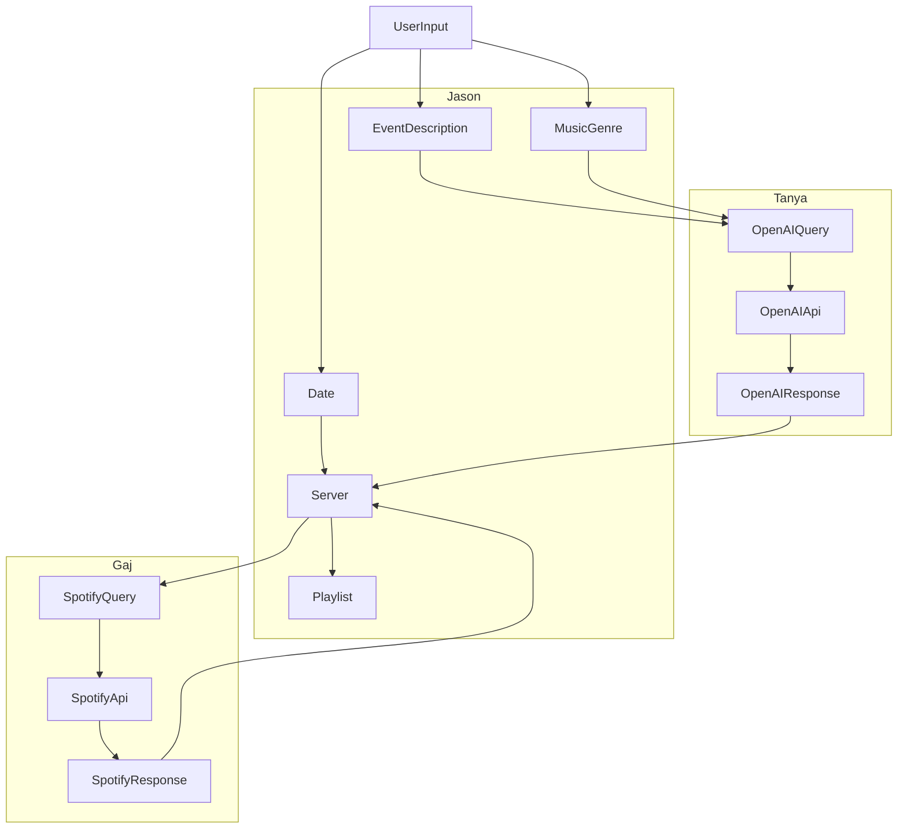

# Mood Time API

The Mood Time API is a TypeScript backend project designed to generate personalized music playlists based on user-selected dates, mood descriptions, and music genres. It leverages OpenAI's API to interpret user moods and Spotify's API to fetch relevant tracks, providing a curated playlist of 10 songs tailored to the user's input.

## Table of Contents

- [Architecture](#architecture)
- [Project Structure](#project-structure)
- [API Endpoints](#api-endpoints)
- [Custom Types and Interfaces](#custom-types-and-interfaces)
- [Setup and Installation](#setup-and-installation)
- [Running the Project](#running-the-project)
- [Usage](#usage)
- [Contributing](#contributing)
- [License](#license)
- [Acknowledgments](#acknowledgments)

## Architecture



## Project Structure

```
├── controllers
│   ├── openai
│   │   └── index.ts
│   ├── server
│   │   └── index.ts
│   ├── spotify
│   │   └── index.ts
│   └── index.js
├── data
│   ├── demo
│   │   └── album.json
│   └── schema
│       └── categories.json
├── routes
│   ├── openai
│   │   └── router.ts
│   ├── playlist
│   │   └── router.ts
│   ├── server
│   │   └── router.ts
│   ├── spotify
│   │   └── router.ts
│   └── router.js
├── types
│   ├── openaiQuery.ts
│   ├── openaiResponse.ts
│   ├── spotifyQuery.ts
│   ├── spotifyResponse.ts
│   └── userInput.ts
├── app.ts
├── swagger.ts
├── package.json
└── README.md
```

- **controllers**: Contains the main logic for handling API requests and interactions with OpenAI and Spotify APIs.
- **data**: Includes JSON datasets required for processing inputs and responses.
- **routes**: Defines the Express routers for different endpoints.
- **types**: Contains TypeScript interface and type definitions.
- **app.ts**: The main entry point of the application.
- **swagger.ts**: Configures Swagger for API documentation.
- **package.json**: Contains project dependencies and scripts.
- **README.md**: Project documentation.

## API Endpoints

### User Endpoint

#### `GET /`

Processes user input and returns a playlist of songs.

- **Request Body**: [`UserInput`](#userinput)
- **Response**: [`SpotifyResponse`](#spotifyresponse)

### Dev Endpoints

#### `GET /openai`

Retrieves the latest inferred mood and spotify feature metric settings from OpenAI.

- **Request Body**: [`OpenAIQuery`](#openaiquery)
- **Response**: [`OpenAIResponse`](#openairesponse)

### Spotify Endpoints

#### `GET /spotify`

Searches for tracks based on a predefined genre.

- **Request Body**: [`SpotifyQuery`](#spotifyquery)
- **Response**: [`SpotifyResponse`](#spotifyresponse)

## Custom Types and Interfaces

### `UserInput`

```typescript
export interface UserInput extends OpenAIQuery {
  date: Date;
}
```

### `OpenAIQuery`

```typescript
export interface OpenAIQuery {
  eventDescription: string;
  musicGenre: string;
}
```

### `OpenAIResponse`

```typescript
export interface OpenAIResponse {
  mood: string;
  genre: string;
  spotifyFeatures: SpotifyFeatures;
}
```

### `SpotifyFeatures`

```typescript
export interface SpotifyFeatures {
  valence: number;
  energy: number;
  danceability: number;
  acousticness: number;
  tempo: number;
}
```

### `SpotifyQuery`

```typescript
export interface SpotifyQuery extends OpenAIResponse {
  date: Date;
  spotifyFeatures: SpotifyFeatures;
}
```

### `Track`

```typescript
export interface Track {
  title: string;
  artist: string;
  album: string;
  releaseDate: Date;
  duration: number;
}
```

### `SpotifyResponse`

```typescript
export type SpotifyResponse = Track[];
```

## Setup and Installation

### Prerequisites

- **Node.js** (v14 or higher)
- **npm** or **yarn**
- **TypeScript** (installed globally)

### Installation Steps

1. **Clone the Repository**

   ```bash
   git clone https://github.com/fac30/PRO03_Gaj_Jason_Max_Tania.git
   cd PRO03_Gaj_Jason_Max_Tania
   ```

2. **Install Dependencies**

   ```bash
   npm install
   ```

3. **Create a `.env` File**

   Create a `.env` file in the root directory and add your API keys:

   ```env
   PORT=3000
   OPENAI_API_KEY=your_openai_api_key
   SPOTIFY_CLIENT_ID=your_spotify_client_id
   SPOTIFY_CLIENT_SECRET=your_spotify_client_secret
   ```

4. **Compile TypeScript**

   ```bash
   tsc
   ```

## Running the Project

Start the server by running:

```bash
npm start
```

The API will be available at `http://localhost:3000`.

## Usage

### Accessing API Documentation

Visit `http://localhost:3000/api-docs` to view the Swagger UI documentation and interact with the API endpoints.

### Example Workflow

1. **User Input**

   The user provides:

   - `date`: Selected date.
   - `eventDescription`: Description of the mood or event.
   - `musicGenre`: Preferred music genre.

2. **OpenAI Processing**

   - The `eventDescription` and `musicGenre` are sent to OpenAI via the `/openai/query` endpoint.
   - OpenAI returns an inferred mood and possibly refined genre.

3. **Generating Spotify Query**

   - The server combines the `date`, OpenAI's response, and predefined `spotifyFeatures` to create a `SpotifyQuery`.

4. **Fetching Tracks from Spotify**

   - The `SpotifyQuery` is sent to Spotify via the `/spotify/search` endpoint.
   - Spotify returns a list of tracks matching the criteria.

5. **Returning the Playlist**

   - The server compiles the tracks into a `SpotifyResponse` and returns it to the user via the `/playlist` endpoint.

### Sample Requests

#### Generate a Playlist

```bash
POST /playlist
Content-Type: application/json

{
  "date": "2023-10-01",
  "eventDescription": "Feeling happy and energetic",
  "musicGenre": "pop"
}
```

#### Get OpenAI Mood Inference

```bash
POST /openai/query
Content-Type: application/json

{
  "eventDescription": "Feeling happy and energetic",
  "musicGenre": "pop"
}
```

#### Search Spotify Tracks

```bash
GET /spotify/search?genre=pop
```

## Contributing

We welcome contributions from developers interested in enhancing the Mood Time API.

### Steps to Contribute

1. **Fork the Repository**

2. **Create a New Branch**

   ```bash
   git checkout -b feature/your-feature-name
   ```

3. **Make Your Changes**

4. **Commit and Push**

   ```bash
   git commit -m "Add your message"
   git push origin feature/your-feature-name
   ```

5. **Create a Pull Request**

## License

This project is licensed under the MIT License.

## Acknowledgments

- **OpenAI**: For providing the AI models to interpret user moods.
- **Spotify**: For access to the rich database of music tracks.
- **FAC30 Team**: For collaboration and development efforts.

---

For more information, please visit our [GitHub repository](https://github.com/fac30/PRO03_Gaj_Jason_Max_Tania).