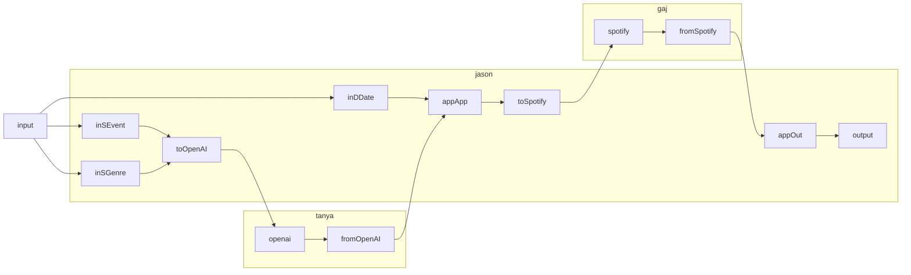

# Routes Scratchpad

```mermaid
    graph LR
    input --> inSEvent & inSGenre & inDDate
    output
    subgraph jason
        inSEvent --> toOpenAI
        inSGenre --> toOpenAI
        inDDate --> appApp
        appApp --> toSpotify
        appOut --> output
    end
    subgraph tanya
        toOpenAI --> openai
        openai --> fromOpenAI
        fromOpenAI --> appApp
    end
    subgraph gaj
        toSpotify --> spotify
        spotify --> fromSpotify
        fromSpotify --> appOut
    end
```
