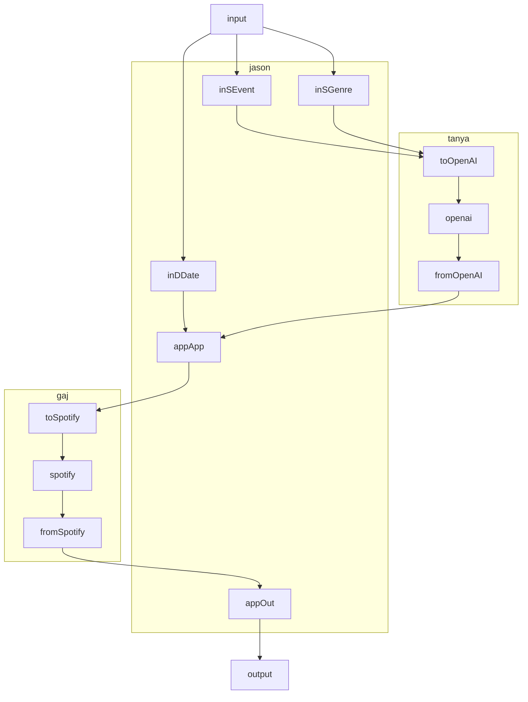

# Routes Scratchpad

```mermaid
    graph TD

    input
    output
    
    subgraph jason
        inSEvent
        inSGenre
        inDDate
        appApp
        appOut
    end

    subgraph tanya
        toOpenAI
        openai
        fromOpenAI
    end

    subgraph gaj
        toSpotify
        spotify
        fromSpotify
    end


    input --> inSEvent & inSGenre & inDDate
    inSEvent & inSGenre --> toOpenAI
    toOpenAI --> openai
    openai --> fromOpenAI
    inDDate & fromOpenAI --> appApp
    appApp --> toSpotify
    toSpotify --> spotify
    spotify --> fromSpotify
    fromSpotify --> appOut
    appOut --> output
```
